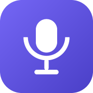

# 議事録レコーダー (PWA)

講演会や会議を録音し、議事録にまとめて、そのまま Claude に渡してレポートを作るスマホ向けアプリ。

**このアプリの本体は録音です。** まず確実に録れることを優先し、
文字起こしは録音とは切り離して、動く手段から順に足していく方針にしています。



## コンセプト

1. **まず確実に録る** — 録音を最優先で開始する。他の機能が失敗しても録音は止めない
2. **その場で目印を残す** — 気づいたことは時刻つきメモに。あとで聞き返す手がかりになる
3. **読みやすい形で残る** — 本文は**句点・読点のタイミングで改行**され、長い行にならない
4. **Claude に渡すところまでが仕事** — レポート用のプロンプトを組み立ててワンタップでコピー

配色は**ダークが既定**。設定でライト(薄いグレー + 青紫)や端末連動にも切り替えられます。

## 主な機能

### 録音(本体)
- 大きな録音ボタン、経過時間、入力レベルのメーター
- 48kHz・モノラル・128kbps で録音。マイクの前処理は「近くの声/遠くの声」から選べる
- **録音時間に上限はありません**。端末の保存領域が続くかぎり記録できます
  (行数が増えても重くならないよう、画面に描く行数と自動保存の間隔を自動で調整します)
- 録音中は画面を消さない(Screen Wake Lock、対応端末のみ)
- 録音中の「メモ」は**その時刻に紐づけて**保存され、あとで聞き返す目印になる
- 音声は端末内(IndexedDB)に保存。詳細画面から 15秒送り/戻し・0.75〜2倍速で聞き返せる
- 音声ファイルはいつでも書き出せる(.webm / .m4a)

### 文字起こし(試験中・任意)
ライブ文字起こしは Web Speech API を使いますが、**端末によって動きません**。
設定の「文字起こしをテストする」で10秒だけ試し、動く端末でだけ有効にしてください。
有効にしても録音とは独立していて、認識が動かなくても録音は止まりません。

#### 聞き取りの精度を上げる工夫
| 仕組み | 内容 |
| --- | --- |
| マイクの拾い方 | 「近くの声(会議)」は雑音とエコーを抑え、「遠くの声(講演)」はノイズ抑制を切って離れた小さな声も削らずに拾う |
| 取りこぼしの救済 | 認識の再開をまたぐ瞬間に確定しなかったテキストも拾い上げ、重複は自動で畳む。再開までの待ち時間も最小限にする |
| 用語辞書 | 固有名詞や専門用語の「聞き間違えられる表記」を登録すると、文字起こしの時点で正しい表記へ自動で置換(ひらがな/カタカナの違いは吸収) |
| フィラー除去 | 「えー」「あのー」などの言いよどみを、語頭・句読点直後にあるものだけ取り除く(「あの人」のような通常の語は残す) |
| 自信のない認識の可視化 | 確信度の低い発言を録音画面で薄く表示。他の認識候補も保存し、Claude へのプロンプトに「聞き取りがあやしい箇所」として添える |
| 音量の案内 | 入力音量を見張り、小さすぎる/大きすぎるときに端末の置き方を案内する |
| マイクの譲り合い | 認識器がマイクを掴めないときは音声保存を止めて、文字起こしを優先する |

#### マイクは同時に使えない
多くの Android 端末では、**録音(MediaRecorder)と音声認識が同時にマイクを使えません**。
録音がマイクを掴んでいる間、認識側は無言のまま何も返しません。

このアプリは**録音を優先**します。録音を先に開始し、ライブ文字起こしは
そのあとで試すだけなので、認識が動かなくても録音が欠けることはありません。
動いていない場合は録音画面にその旨を表示します(録音は続きます)。

### 読みやすい整形(`js/format.js`)
音声認識の日本語には句読点が入らないため、次の処理を行います。

| 処理 | 内容 |
| --- | --- |
| 句点を補う | 「〜ました」「〜です」などの文末表現を検出して `。` を打つ。「〜ですが」「〜ますので」のように文が続く場合は打たない |
| 読点を補う | 「〜ので」「〜けれども」などの節の切れ目や、接続詞の手前に `、` を打つ。直前の句読点から一定の文字数が経っていないときは打たない |
| 改行する | **句点・読点の位置を最優先に改行**。句読点がない長い文は助詞のうしろで折り返す。「です/ます」「〜してい/ます」「とい/う」のような語の途中や、括弧の内側では折り返さない |

1行の長さは設定で「短め(16字)/標準(22字)/長め(30字)」から選べます。

### 編集と書き出し
- タイトル・本文・参加者・メモを編集でき、入力するそばから自動保存
- 「改行を整える」で、手で直したあとの改行を引き直す
- 「認識結果から作り直す」で編集前の状態に戻す(タイムスタンプ付きも選べる)
- Markdown / テキスト / 録音した音声ファイルを書き出し、他アプリへ共有

### 文字起こしが動かないときは
設定の**「文字起こしをテストする」**で、10秒間だけ認識を動かして状態を確かめられます
(認識の開始・確定した認識・エラーが時刻つきで並び、そのままコピーできます)。

既知の制約:

- ブラウザは**ユーザーが押した操作と同じ実行の流れ**でしか音声認識を開始できません。
  `await` をはさんで呼ぶと、許可も求められないまま無言で失敗します
- 多くの Android 端末は録音中に認識できません(上記「マイクは同時に使えない」)
- iPhone でホーム画面から起動したアプリでは音声認識が動かないことがあります。その場合は Safari で開いてください
- **Claude は音声ファイルを直接受け取れません**(対応入力はテキスト・画像・PDF)。
  録音から文字起こしを作るには、別の手段が必要です

### Claude へのレポート依頼
議事録の本文に、レポートの指示とメタ情報(日時・参加者・所要時間)、
そして確信度の低かった発言の別候補を添えたプロンプトを生成します。
テンプレートは4種類。

- **議事録レポート** — サマリー / 論点 / 決定事項 / ToDo / 持ち越し
- **講演レポート** — 主旨 / 構成 / 重要ポイント / 引用 / 用語解説
- **ToDo抽出** — 内容・担当・期限の一覧
- **要約のみ** — 3行サマリーとキーワード

「音声認識なので誤変換がある」前提と、「記録にない事実を書かない」制約をプロンプトに含めています。
ボタンひとつでコピーして claude.ai を開けます。

## 技術構成

- **ビルド不要の静的PWA** — Vanilla JS (ES Modules) + CSS のみ、依存ライブラリなし
- **文字起こし** — Web Speech API (`SpeechRecognition`, `lang=ja-JP`)
- **録音** — MediaRecorder + AnalyserNode(入力レベル表示と音量の監視)
- **保存先はすべて端末内** — IndexedDB(議事録・音声)、localStorage(設定)。サーバー送信なし
- **オフライン対応** — Service Worker がアプリシェルをキャッシュ

### 対応ブラウザ

| 環境 | 文字起こし | 音声保存 |
| --- | --- | --- |
| Android / Chrome | ○ | ○ |
| iPhone / Safari | ○(iOS 14.5+) | ○(iOS 14.3+) |
| PC / Chrome, Edge | ○ | ○ |
| Firefox | × (手入力で利用可) | ○ |

音声認識はネットワーク接続が必要です(端末がサーバーへ音声を送って認識します)。
未対応のブラウザでも、手入力で議事録を作って Claude に渡す使い方はできます。

## 動かし方

静的ファイルを配信するだけで動きます。マイクを使うため `https` か `localhost` が必要です。

```bash
python3 -m http.server 8000
# → http://localhost:8000/minutes/ を開く
```

GitHub Pages に置けば、スマホから「ホーム画面に追加」でアプリとしてインストールできます。

## ディレクトリ構成

```
minutes/
  index.html            アプリシェル
  manifest.webmanifest  PWAマニフェスト
  sw.js                 Service Worker(オフラインキャッシュ)
  css/style.css         ダーク/ライトの配色(青紫のアクセント)
  js/
    app.js              ルーター + SW登録
    db.js               IndexedDB / 設定
    format.js           句読点の補完・改行・用語辞書・フィラー除去(このアプリの中核)
    theme.js            配色(ダーク/ライト/端末連動)の切り替え
    recognizer.js       音声認識(自動再開つき)
    recorder.js         録音 + 入力レベル + Wake Lock
    prompt.js           Claude 用プロンプトの組み立て
    icons.js            インラインSVGアイコン
    util.js             DOM生成・整形・トースト等
    views/
      list.js           一覧・検索・設定
      record.js         録音と文字起こし
      detail.js         編集・書き出し・Claude連携
  icons/                PWAアイコン(tools/gen-icons.mjs で生成)
  tools/gen-icons.mjs   依存なしのPNGアイコン生成スクリプト
```

## アイコンの再生成

```bash
node minutes/tools/gen-icons.mjs
```
